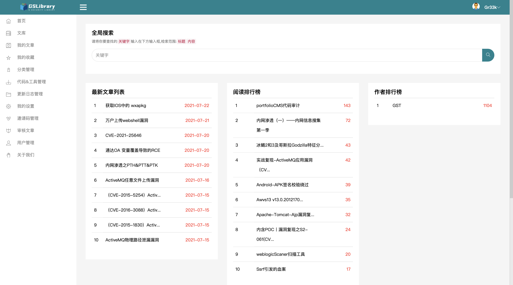

# GSLibrary 安装手册（个人DEBUG版安装）


- - - -

## 须知
👻👻本知识库禁止在互联网上进行搭建，若出现互联网可访问的GSLibrary本人概不负责，欢迎关注我们的公众号。


- - - -
## 使用场景
为了方便大家的使用本知识库可以做为个人的知识库管理工具武器库管理工具，也可以搭建在内网中作为团队的知识库和武器库管理工具，针对使用场景的不同知识库发挥的作用也不同，推荐大家搭建在内网通过团队进行维护使其一直成长下去。

- - - -
## 开发工具
本知识库使用Python3 + Django 开发，属于轻量级知识库管理工具，他的代码量少、结构清晰。欢迎各位开发者进行二次开发。GSLibrary现在支持的功能有：

	1. 文章的书写、阅读、搜索、收藏、审核、排名
	2. 栏目与标签管理
	3. 工具的上传、下载、搜索
	4. 用户及邀请码管理

## 安装
### 一、数据库

使用mysql数据库，安装方式任意phpstudy也可，这里测试的版本为mysql5.7与mysql8。

### 二、clone 代码到本地并安装依赖

```
git clone https://github.com/G-Security-Team/GSLibrary.git
python3 -m pip install -r requirements.txt
```

### 三、初始化数据库

可以使用图形化工具进行创建数据库，数据库名：**zslibrary**，随后选择导入sql文件选中项目目录下的zslibrary.sql即可。

若您使用的是命令行，则命令如下，默认数据库密码：Gr33kLibrary_pass1997!
```
mysql -uroot -p
password:**********

create database zslibrary;
use zslibrary;
source GSLibrary/zslibrary.sql;
```

### 四、启动GSLibrary

```
python3 manage.py runserver 127.0.0.1:8000
```

😘😘访问本机8000端口即可，初始帐号密码 Gr33k/123456


### 五、预览



### 六、关于我们

